# python_labs
### LAB01
### Задание 1
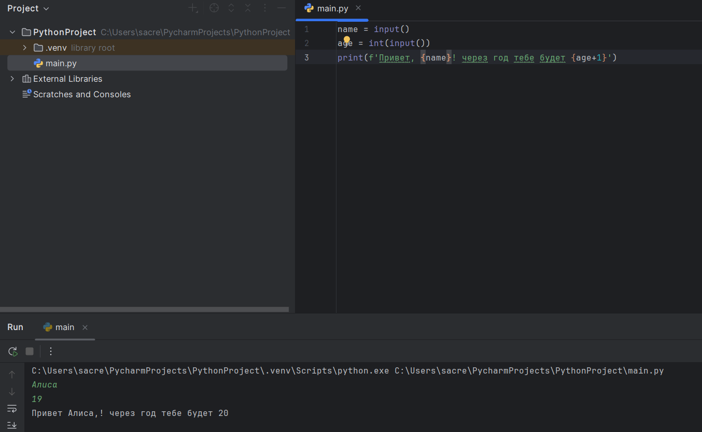
```python


name = input()
age = int(input())
print (f'Привет,{name}! через год тебе будет {age+1} ' )
```
### Задание 2
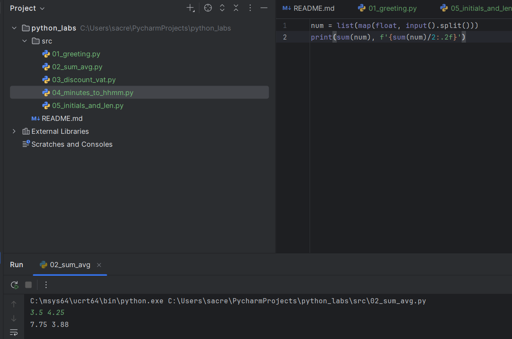
```Python


num = list(map(float, input().split()))
print(sum(num), f'{sum(num)/2:.2f}')
```
### Задание 3
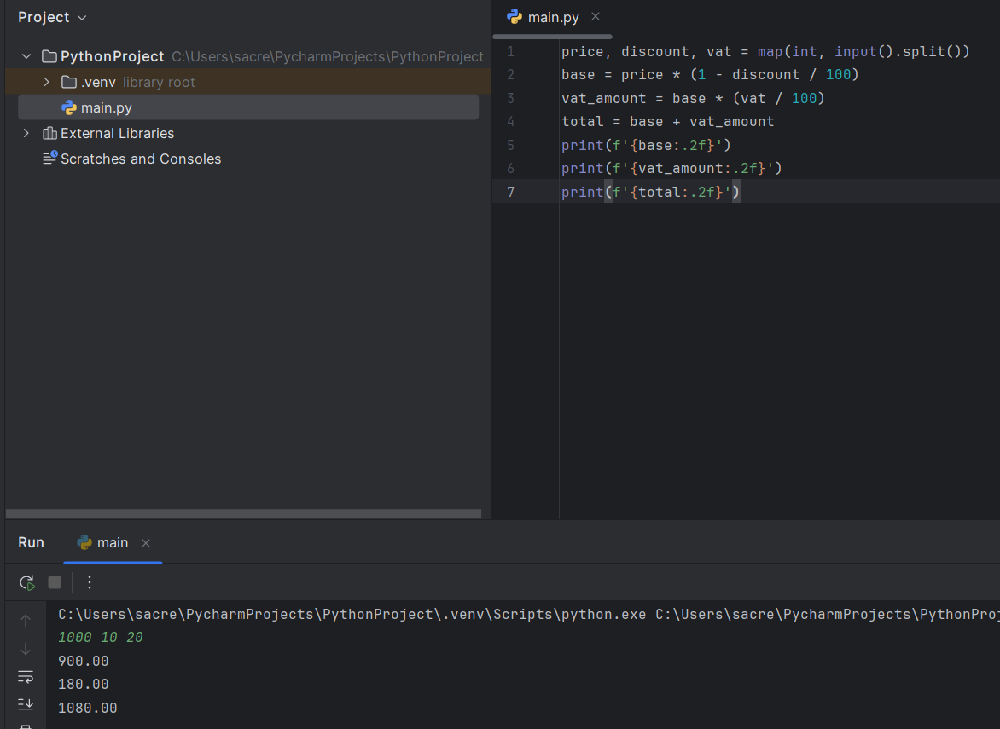
```Python


price, discount, vat = map(int, input().split())
base = price * (1 - discount / 100)
vat_amount = base * (vat / 100)
total = base + vat_amount
print(f'{base :.2f}')
print(f'{vat_amount :.2f}')
print(f'{total :.2f}')
```
### Задание 4
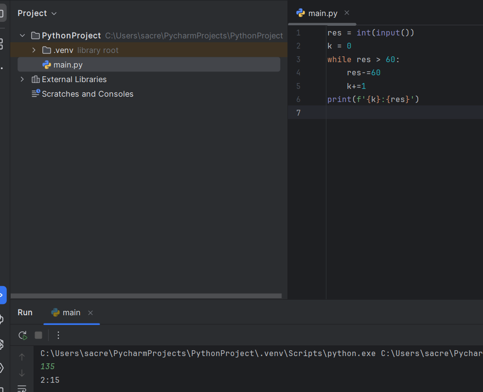
```Python


res = int(input())
k = 0
while res > 60:
    res -= 60
    k+=1
print(f'{k}:{res}')
```
### Задание 5
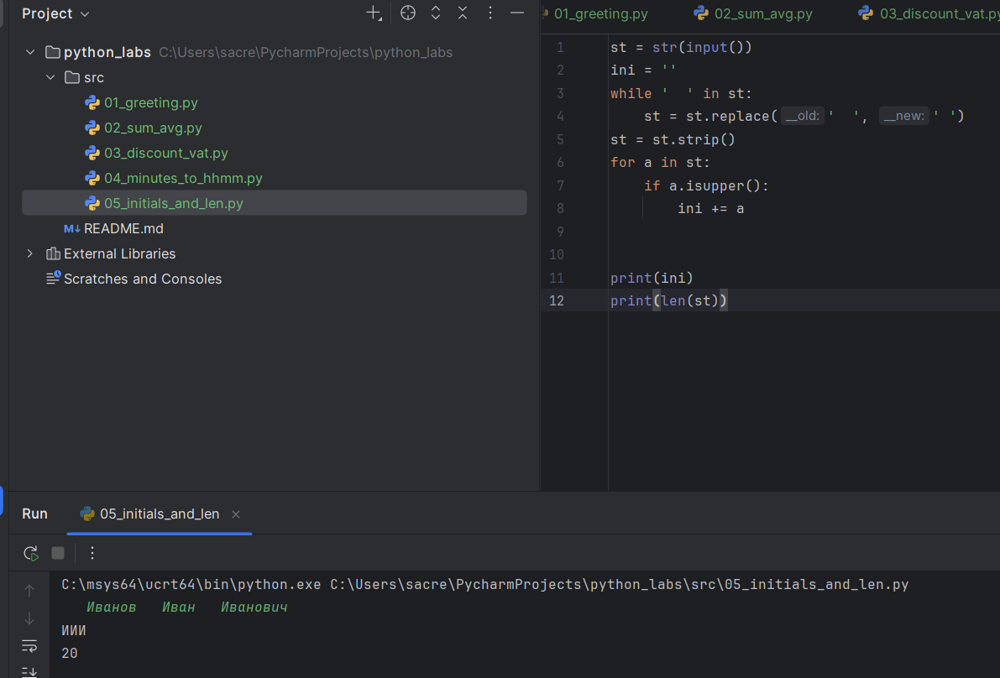
```Python

st = str(input())
ini = ''
while '  ' in st:
    st = st.replace('  ', ' ')
st = st.strip()
for a in st:
    if a.isupper():
        ini += a


print(ini)
print(len(st))
```
### Задание 7
```python
st = str(input())
ans = ''
step = []
k = 0
k1 = 0
k2 = 0
for a in st:
    k+=1
    if a.isupper():
        l = st.find(a)
        st = st[l:]
        ans += a
        k1 = k
    elif a.isdigit():
        k2 = k
        step.append(k2-k1+1)
        rstep = min(step)

for i in range(0,len(st), rstep):
    print(st[i])
```
### LAB02
### Задание 1

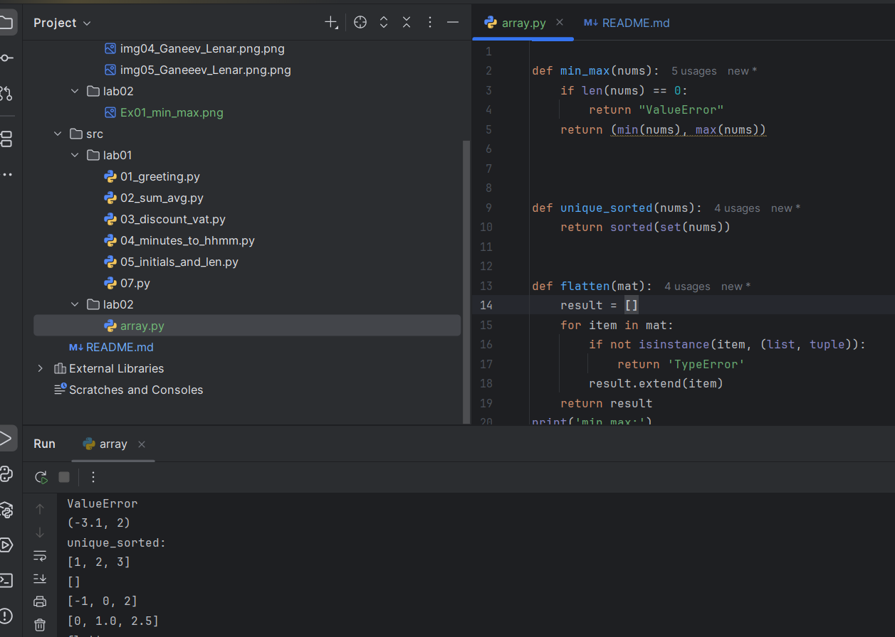
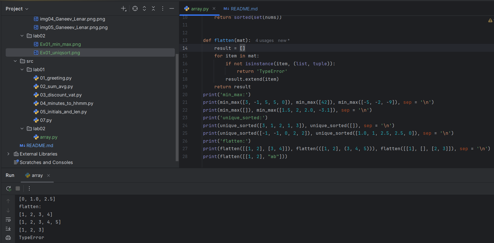
```python
def min_max(nums):
    if len(nums) == 0:
        return "ValueError"
    return (min(nums), max(nums))


def unique_sorted(nums):
    return sorted(set(nums))


def flatten(mat):
    result = []
    for item in mat:
        if not isinstance(item, (list, tuple)):
            return 'TypeError'
        result.extend(item)
    return result
print('min_max:')
print(min_max([3, -1, 5, 5, 0]), min_max([42]), min_max([-5, -2, -9]), sep = '\n')
print(min_max([]), min_max([1.5, 2, 2.0, -3.1]), sep = '\n')
print('unique_sorted:')
print(unique_sorted([3, 1, 2, 1, 3]), unique_sorted([]), sep = '\n')
print(unique_sorted([-1, -1, 0, 2, 2]), unique_sorted([1.0, 1, 2.5, 2.5, 0]), sep = '\n')
print('flatten:')
print(flatten([[1, 2], [3, 4]]), flatten(([1, 2], (3, 4, 5))), flatten([[1], [], [2, 3]]), sep = '\n')
print(flatten([[1, 2], "ab"]))
```
### Задание 2
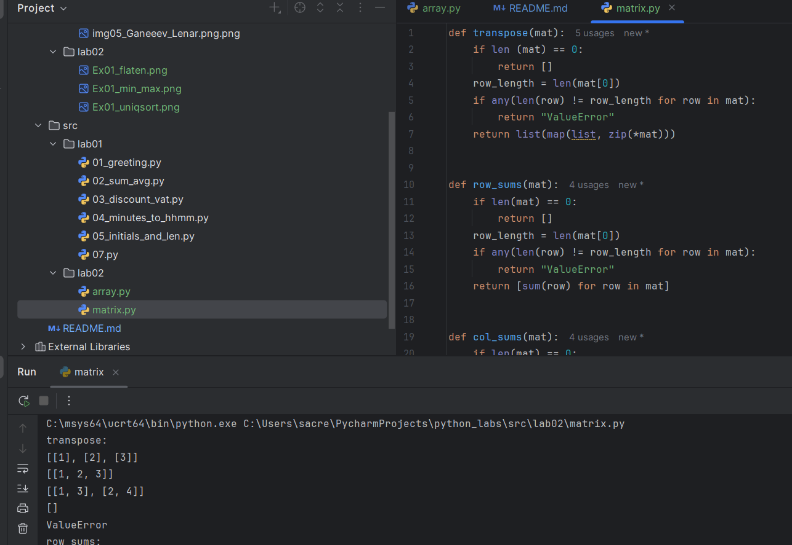
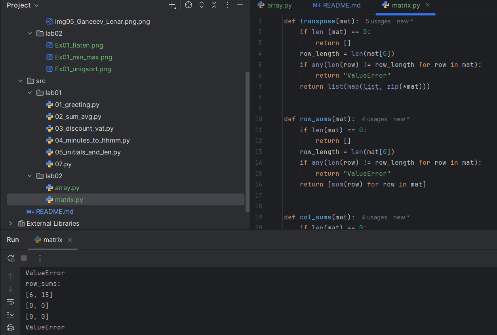
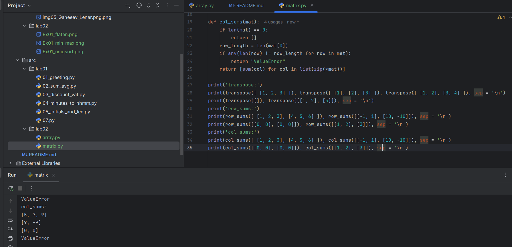
```python
def transpose(mat):
    if len (mat) == 0:
        return []
    row_length = len(mat[0])
    if any(len(row) != row_length for row in mat):
        return "ValueError"
    return list(map(list, zip(*mat)))


def row_sums(mat):
    if len(mat) == 0:
        return []
    row_length = len(mat[0])
    if any(len(row) != row_length for row in mat):
        return "ValueError"
    return [sum(row) for row in mat]


def col_sums(mat):
    if len(mat) == 0:
        return []
    row_length = len(mat[0])
    if any(len(row) != row_length for row in mat):
        return "ValueError"
    return [sum(col) for col in list(zip(*mat))]

print('transpose:')
print(transpose([ [1, 2, 3] ]), transpose([ [1], [2], [3] ]), transpose([ [1, 2], [3, 4] ]), sep = '\n')
print(transpose([]), transpose([[1, 2], [3]]), sep = '\n')
print('row_sums:')
print(row_sums([ [1, 2, 3], [4, 5, 6] ]), row_sums([[-1, 1], [10, -10]]), sep = '\n')
print(row_sums([[0, 0], [0, 0]]), row_sums([[1, 2], [3]]), sep = '\n')
print('col_sums:')
print(col_sums([ [1, 2, 3], [4, 5, 6] ]), col_sums([[-1, 1], [10, -10]]), sep = '\n')
print(col_sums([[0, 0], [0, 0]]), col_sums([[1, 2], [3]]), sep = '\n')
```
### Задание 2
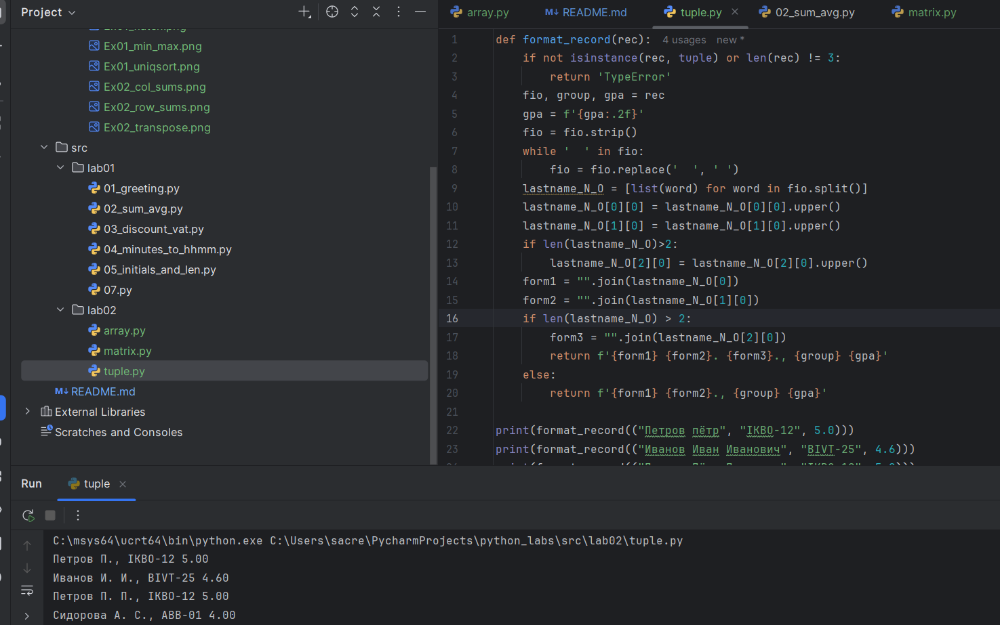
```python
def format_record(rec):
    if not isinstance(rec, tuple) or len(rec) != 3:
        return 'TypeError'
    fio, group, gpa = rec
    gpa = f'{gpa:.2f}'
    fio = fio.strip()
    while '  ' in fio:
        fio = fio.replace('  ', ' ')
    lastname_N_O = [list(word) for word in fio.split()]
    lastname_N_O[0][0] = lastname_N_O[0][0].upper()
    lastname_N_O[1][0] = lastname_N_O[1][0].upper()
    if len(lastname_N_O)>2:
        lastname_N_O[2][0] = lastname_N_O[2][0].upper()
    form1 = "".join(lastname_N_O[0])
    form2 = "".join(lastname_N_O[1][0])
    if len(lastname_N_O) > 2:
        form3 = "".join(lastname_N_O[2][0])
        return f'{form1} {form2}. {form3}., {group} {gpa}'
    else:
        return f'{form1} {form2}., {group} {gpa}'

print(format_record(("Петров пётр", "IKBO-12", 5.0)))
print(format_record(("Иванов Иван Иванович", "BIVT-25", 4.6)))
print(format_record(("Петров Пётр Петрович", "IKBO-12", 5.0)))
print(format_record(("  сидорова  анна   сергеевна ", "ABB-01", 3.999)))
```
### LAB03
### Задание 1
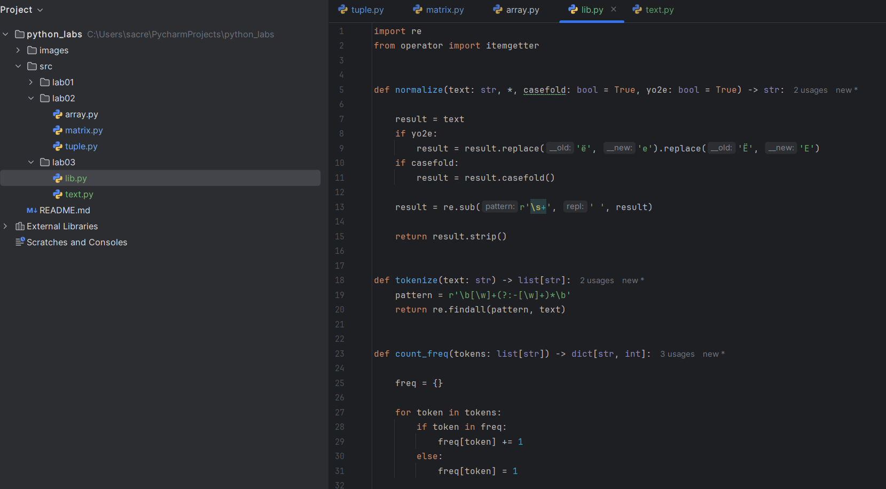
```python
import re
from operator import itemgetter


def normalize(text: str, *, casefold: bool = True, yo2e: bool = True) -> str:

    result = text
    if yo2e:
        result = result.replace('ё', 'е').replace('Ё', 'Е')
    if casefold:
        result = result.casefold()

    result = re.sub(r'\s+', ' ', result)

    return result.strip()


def tokenize(text: str) -> list[str]:
    pattern = r'\b[\w]+(?:-[\w]+)*\b'
    return re.findall(pattern, text)


def count_freq(tokens: list[str]) -> dict[str, int]:

    freq = {}

    for token in tokens:
        if token in freq:
            freq[token] += 1
        else:
            freq[token] = 1

    return freq


def top_n(freq: dict[str, int], n: int = 5) -> list[tuple[str, int]]:
    items = list(freq.items())
    items.sort(key=itemgetter(0))
    items.sort(key=itemgetter(1), reverse=True)
    return items[:n]
```
### Задание 2
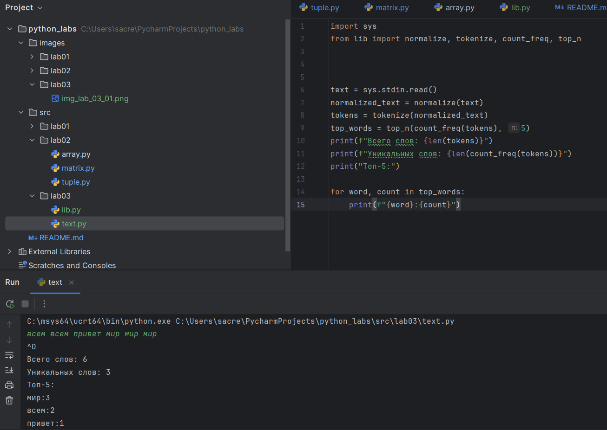
```python
import sys
from lib import normalize, tokenize, count_freq, top_n


text = sys.stdin.read()
normalized_text = normalize(text)
tokens = tokenize(normalized_text)
top_words = top_n(count_freq(tokens), 5)
print(f"Всего слов: {len(tokens)}")
print(f"Уникальных слов: {len(count_freq(tokens))}")
print("Топ-5:")

for word, count in top_words:
    print(f"{word}:{count}")
```
### LAB04
### Задание 1
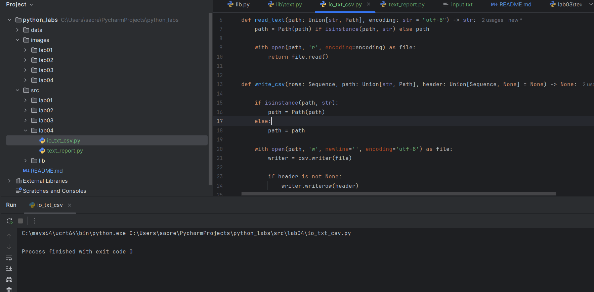
```python
import csv
from pathlib import Path
from typing import Sequence, Union


def read_text(path: Union[str, Path], encoding: str = "utf-8") -> str:
    path = Path(path) if isinstance(path, str) else path

    with open(path, 'r', encoding=encoding) as file:
        return file.read()


def write_csv(rows: Sequence, path: Union[str, Path], header: Union[Sequence, None] = None) -> None:

    if isinstance(path, str):
        path = Path(path)
    else:
        path = path

    with open(path, 'w', newline='', encoding='utf-8') as file:
        writer = csv.writer(file)

        if header is not None:
            writer.writerow(header)

        for row in rows:
            writer.writerow(row)


```
### Задание 2
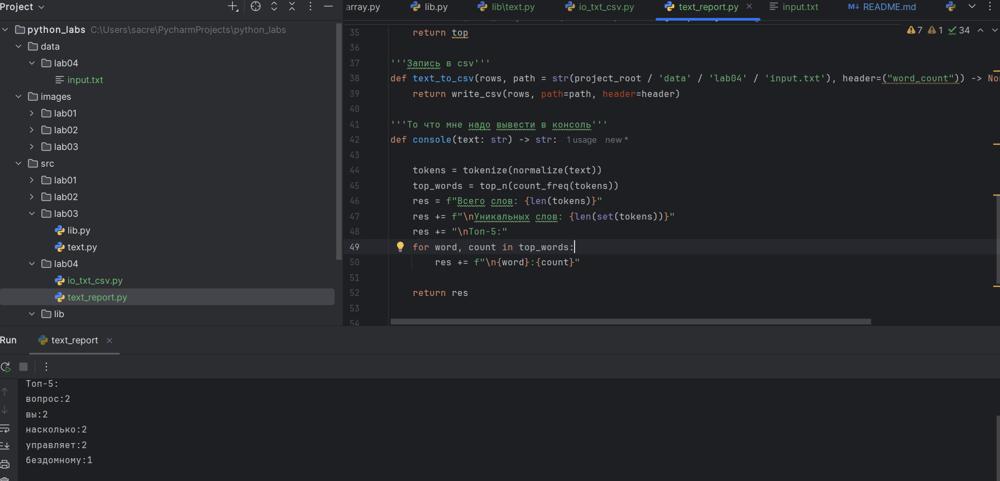
```python
import sys

'''добавляем нужный нам путь в список путей откуда мложно импортировать модули'''
sys.path.append("C:/Users/sacre/PycharmProjects/python_labs/src/lib")
from src.lib.text import normalize, tokenize, count_freq, top_n
from io_txt_csv import read_text, write_csv
from pathlib import Path
import argparse

current_dir = Path(__file__).parent
project_root = current_dir.parent.parent


'''Функция которая читает содержимое файла'''
def read_file_content(file_path: Path, encoding: str = "utf-8") -> str:
    try:

        return read_text(file_path, encoding=encoding)
    except FileNotFoundError:
        raise FileNotFoundError(f'Ошибка: файл {file_path} не найден')

    except UnicodeDecodeError as error:
        raise UnicodeDecodeError(f'Ошибка кодировки: {error}. Попробуйте указать другую кодировку')

'''Всё что связано с третьей лабой'''
def calculate_word_frequencies(text: str) -> dict[str, int]:
    if not text.strip():
        return {}

    normalized_text = normalize(text, casefold=True, yo2e=True)
    tokens = tokenize(normalized_text)
    frequencies = count_freq(tokens)
    top = top_n(frequencies)
    return top

'''Запись в csv'''
def text_to_csv(rows, path = str(project_root / 'data' / 'lab04' / 'input.txt'), header=("word_count")) -> None:
    return write_csv(rows, path=path, header=header)

'''То что мне надо вывести в консоль'''
def console(text: str) -> str:

    tokens = tokenize(normalize(text))
    top_words = top_n(count_freq(tokens))
    res = f"Всего слов: {len(tokens)}"
    res += f"\nУникальных слов: {len(set(tokens))}"
    res += "\nТоп-5:"
    for word, count in top_words:
        res += f"\n{word}:{count}"

    return res


text_content = read_file_content(str(project_root / 'data' / 'lab04' / 'input.txt'))
text_to_csv(calculate_word_frequencies(text_content))
print(console(text_content))
```
### LAB05
### Задание 1
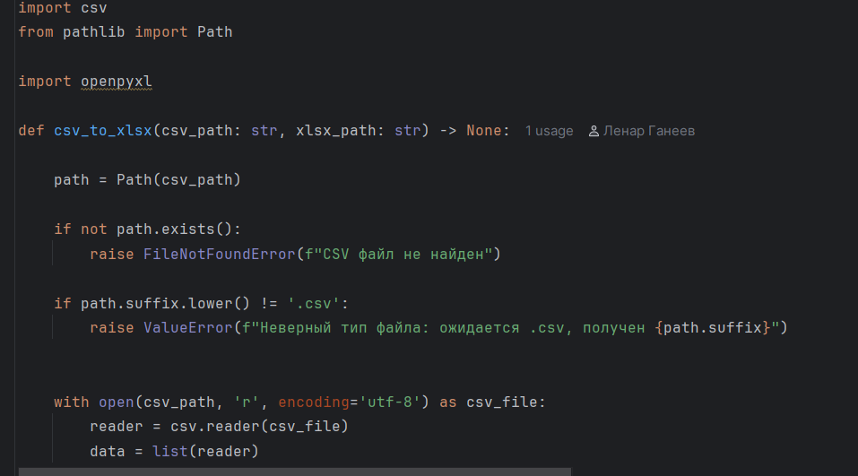
```python
import csv
import json
from pathlib import Path


def json_to_csv(json_path: str, csv_path: str) -> None:

    path = Path(json_path)

    if not path.exists():
        raise FileNotFoundError("JSON файл не найден")

    if path.suffix.lower() != '.json':
        raise ValueError("Неверный тип файла")

    try:
        with open(json_path, 'r', encoding='utf-8') as json_file:
            data = json.load(json_file)
    except json.JSONDecodeError:
        raise ValueError("Ошибка декодирования JSON")

    if not isinstance(data, list):
        raise ValueError("JSON должен содержать список объектов")

    if not data:
        raise ValueError("JSON файл пуст")


    all_fields = set()
    for item in data:
        if not isinstance(item, dict):
            raise ValueError("Все элементы JSON должны быть словарями")
        all_fields.update(item.keys())

    fieldnames = sorted(all_fields)

    try:
        with open(csv_path, 'w', encoding='utf-8', newline='') as csv_file:
            writer = csv.DictWriter(csv_file, fieldnames=fieldnames)
            writer.writeheader()


            for item in data:
                row = {field: item.get(field, '') for field in fieldnames}
                writer.writerow(row)

    except Exception as e:
        raise ValueError(f"Ошибка записи CSV: {e}")


def csv_to_json(csv_path: str, json_path: str) -> None:

    path = Path(csv_path)

    if not path.exists():
        raise FileNotFoundError(f"CSV файл не найден")

    if path.suffix.lower() != '.csv':
        raise ValueError(f"получено разрешение {path.suffix} a не .csv")

    try:
        with open(csv_path, 'r', encoding='utf-8') as csv_file:
            reader = csv.DictReader(csv_file)

            if reader.fieldnames is None:
                raise ValueError("CSV файл не содержит заголовков")

            data = list(reader)

    except Exception as e:
        raise ValueError(f"Ошибка чтения CSV: {e}")

    if not data:
        raise ValueError("CSV файл пуст`")

    try:
        with open(json_path, 'w', encoding='utf-8') as json_file:
            json.dump(data, json_file, ensure_ascii=False, indent=2)
    except Exception as e:
        raise ValueError(f"Ошибка записи JSON: {e}")


json_to_csv("C:/Users/sacre/PycharmProjects/python_labs/data/lab05/samples/people.json", "C:/Users/sacre/PycharmProjects/python_labs/data/lab05/out/people_from_json.csv")


csv_to_json("C:/Users/sacre/PycharmProjects/python_labs/data/lab05/samples/people.csv", "C:/Users/sacre/PycharmProjects/python_labs/data/lab05/out/cities_from_csv.json")
```
### Задание 2

```python
import csv
from pathlib import Path

import openpyxl

def csv_to_xlsx(csv_path: str, xlsx_path: str) -> None:

    path = Path(csv_path)

    if not path.exists():
        raise FileNotFoundError(f"CSV файл не найден")

    if path.suffix.lower() != '.csv':
        raise ValueError(f"Неверный тип файла: ожидается .csv, получен {path.suffix}")


    with open(csv_path, 'r', encoding='utf-8') as csv_file:
        reader = csv.reader(csv_file)
        data = list(reader)

    if not data:
        raise ValueError("CSV файл пуст")

    if not data[0]:
        raise ValueError("Первая строка CSV пуста")


    workbook = openpyxl.Workbook()
    sheet = workbook.active
    sheet.title = "Sheet1"


    for row_idx, row in enumerate(data, 1):
        for col_idx, value in enumerate(row, 1):
            sheet.cell(row=row_idx, column=col_idx, value=value)


    for column in sheet.columns:
        max_length = 0
        column_letter = column[0].column_letter

        for cell in column:
            try:
                if cell.value:
                    max_length = max(max_length, len(str(cell.value)))
            except:
                pass

        adjusted_width = max(max_length + 2, 8)
        sheet.column_dimensions[column_letter].width = adjusted_width


    workbook.save(xlsx_path)


print(csv_to_xlsx('C:/Users/sacre/PycharmProjects/python_labs/data/lab05/samples/cities.csv', 'C:/Users/sacre/PycharmProjects/python_labs/data/lab05/out/people.xlsx'))
```
### LAB06
### Задание 1
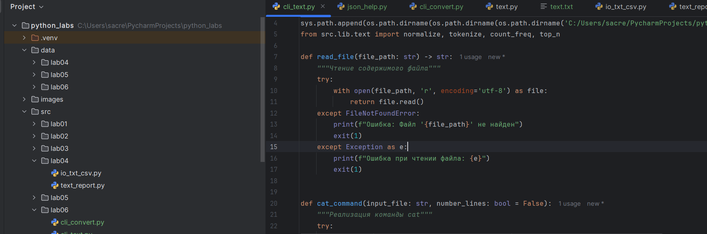
```python
import argparse
import sys
import os
sys.path.append(os.path.dirname(os.path.dirname(os.path.dirname('C:/Users/sacre/PycharmProjects/python_labs/src/lib/text.py'))))
from src.lib.text import normalize, tokenize, count_freq, top_n

def read_file(file_path: str) -> str:
    """Чтение содержимого файла"""
    try:
        with open(file_path, 'r', encoding='utf-8') as file:
            return file.read()
    except FileNotFoundError:
        print(f"Ошибка: Файл '{file_path}' не найден")
        exit(1)
    except Exception as e:
        print(f"Ошибка при чтении файла: {e}")
        exit(1)


def cat_command(input_file: str, number_lines: bool = False):
    """Реализация команды cat"""
    try:
        with open(input_file, 'r', encoding='utf-8') as file:
            lines = file.readlines()

            for i, line in enumerate(lines, 1):
                if number_lines:
                    print(f"{i:6d}\t{line.rstrip()}")
                else:
                    print(line.rstrip())

    except FileNotFoundError:
        raise FileNotFoundError("файл не найден")

def stats_command(input_file: str, top_count: int = 5):
    """Реализация команды stats"""
    try:
        text = read_file(input_file)

        normalized_text = normalize(text)
        tokens = tokenize(normalized_text)
        frequencies = count_freq(tokens)
        top_words = top_n(frequencies, top_count)

        # Выводим результаты
        print(f"Всего слов: {len(tokens)}")
        print(f"Уникальных слов: {len(frequencies)}")
        print(f"\nТоп-{top_count} самых частых слов:")
        print("-" * 30)

        for i, (word, count) in enumerate(top_words, 1):
            print(f"{i:2d}. {word:<20} {count:>4}")

    except Exception as e:
        print(f"Ошибка при анализе текста: {e}")
        exit(1)


def main():
    parser = argparse.ArgumentParser(description="CLI‑утилиты лабораторной №6")
    subparsers = parser.add_subparsers(dest="command", required=True)

    
    cat_parser = subparsers.add_parser("cat", help="Вывести содержимое файла")
    cat_parser.add_argument("--input", required=True, help="Путь к входному файлу")
    cat_parser.add_argument("-n", action="store_true", help="Нумеровать строки")

    
    stats_parser = subparsers.add_parser("stats", help="Частоты слов")
    stats_parser.add_argument("--input", required=True, help="Путь к входному файлу")
    stats_parser.add_argument("--top", type=int, default=5, help="Количество топ-слов для вывода")

    args = parser.parse_args()

    if args.command == "cat":
        cat_command(args.input, args.n)
    elif args.command == "stats":
        stats_command(args.input, args.top)

if __name__ == "__main__":
    main()
```
### Задание 2
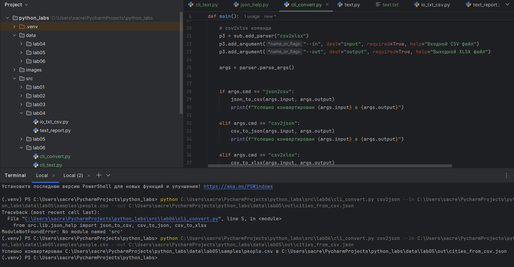
```python
import argparse
import sys
import os
sys.path.append(os.path.dirname(os.path.dirname(os.path.dirname('C:/Users/sacre/PycharmProjects/python_labs/src/lib/json_help.py'))))
from src.lib.json_help import json_to_csv, csv_to_json, csv_to_xlsx
def main():
    parser = argparse.ArgumentParser(description="Конвертеры данных")
    sub = parser.add_subparsers(dest="cmd", required=True)

    p1 = sub.add_parser("json2csv")
    p1.add_argument("--in", dest="input", required=True, help="Входной JSON файл")
    p1.add_argument("--out", dest="output", required=True, help="Выходной CSV файл")


    p2 = sub.add_parser("csv2json")
    p2.add_argument("--in", dest="input", required=True, help="Входной CSV файл")
    p2.add_argument("--out", dest="output", required=True, help="Выходной JSON файл")

    p3 = sub.add_parser("csv2xlsx")
    p3.add_argument("--in", dest="input", required=True, help="Входной CSV файл")
    p3.add_argument("--out", dest="output", required=True, help="Выходной XLSX файл")

    args = parser.parse_args()


    if args.cmd == "json2csv":
        json_to_csv(args.input, args.output)
        print(f"Успешно конвертирован {args.input} в {args.output}")

    elif args.cmd == "csv2json":
        csv_to_json(args.input, args.output)
        print(f"Успешно конвертирован {args.input} в {args.output}")

    elif args.cmd == "csv2xlsx":
        csv_to_xlsx(args.input, args.output)
        print(f"Успешно конвертирован {args.input} в {args.output}")


if __name__ == "__main__":
    main()
```
### LAB07
### Задание 1
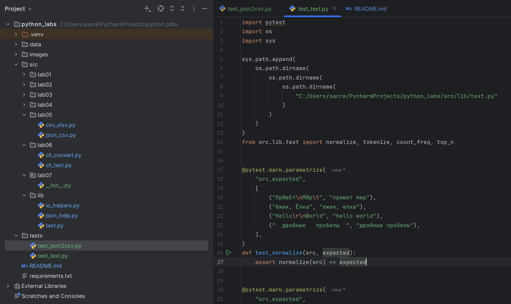
```python
import pytest
import os
import sys

sys.path.append(
    os.path.dirname(
        os.path.dirname(
            os.path.dirname(
                "C:/Users/sacre/PycharmProjects/python_labs/src/lib/text.py"
            )
        )
    )
)
from src.lib.text import normalize, tokenize, count_freq, top_n


@pytest.mark.parametrize(
    "src,expected",
    [
        ("ПрИвЕт\nМИр\t", "привет мир"),
        ("ёжик, Ёлка", "ежик, елка"),
        ("Hello\r\nWorld", "hello world"),
        ("  двойные   пробелы  ", "двойные пробелы"),
    ],
)
def test_normalize(src, expected):
    assert normalize(src) == expected


@pytest.mark.parametrize(
    "src,expected",
    [
        ("привет мир", ["привет", "мир"]),
        ("hello,world!!!", ["hello", "world"]),
        ("по-настоящему круто", ["по-настоящему", "круто"]),
        ("2025 год", ["2025", "год"]),
        ("emoji 😀 не слово", ["emoji", "не", "слово"]),
    ],
)
def test_tokenize(src, expected):
    assert tokenize(src) == expected


def test_count_and_top():
    tokens = ["a", "b", "a", "c", "b", "a"]
    freq = count_freq(tokens)
    assert freq == {"a": 3, "b": 2, "c": 1}
    assert top_n(freq, 2) == [("a", 3), ("b", 2)]


def test_top_tie_breaker():
    freq = count_freq(["bb", "aa", "bb", "aa", "cc"])
    assert top_n(freq, 2) == [("aa", 2), ("bb", 2)]
```
### Задание 2
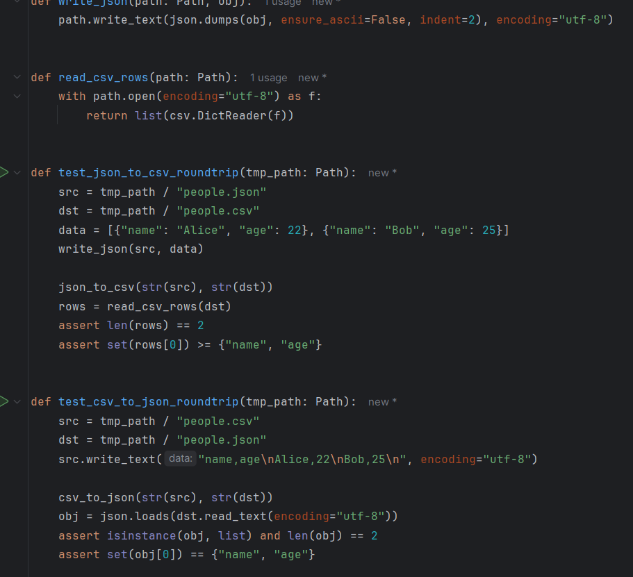
```python
import json, csv
from pathlib import Path
import pytest
import os
import sys

sys.path.append(
    os.path.dirname(
        os.path.dirname(
            os.path.dirname(
                "C:/Users/sacre/PycharmProjects/python_labs/src/lib/json_help.py"
            )
        )
    )
)
from src.lib.json_help import json_to_csv, csv_to_json


def write_json(path: Path, obj):
    path.write_text(json.dumps(obj, ensure_ascii=False, indent=2), encoding="utf-8")


def read_csv_rows(path: Path):
    with path.open(encoding="utf-8") as f:
        return list(csv.DictReader(f))


def test_json_to_csv_roundtrip(tmp_path: Path):
    src = tmp_path / "people.json"
    dst = tmp_path / "people.csv"
    data = [{"name": "Alice", "age": 22}, {"name": "Bob", "age": 25}]
    write_json(src, data)

    json_to_csv(str(src), str(dst))
    rows = read_csv_rows(dst)
    assert len(rows) == 2
    assert set(rows[0]) >= {"name", "age"}


def test_csv_to_json_roundtrip(tmp_path: Path):
    src = tmp_path / "people.csv"
    dst = tmp_path / "people.json"
    src.write_text("name,age\nAlice,22\nBob,25\n", encoding="utf-8")

    csv_to_json(str(src), str(dst))
    obj = json.loads(dst.read_text(encoding="utf-8"))
    assert isinstance(obj, list) and len(obj) == 2
    assert set(obj[0]) == {"name", "age"}


def test_json_to_csv_invalid_json(tmp_path: Path):
    src = tmp_path / "invalid.txt"
    src.write_text("invalid content", encoding="utf-8")
    with pytest.raises(ValueError):
        json_to_csv(str(src), str(tmp_path / "out.csv"))


def test_json_to_csv_invalid_csv(tmp_path: Path):
    csv_path = tmp_path / "invalid.txt"
    csv_path.write_text("invalid content", encoding="utf-8")
    with pytest.raises(ValueError):
        json_to_csv(tmp_path / "input.json", str(csv_path))


def test_json_to_csv_not_exist(tmp_path: Path):
    src = tmp_path / "no_exist.json"
    with pytest.raises(FileNotFoundError):
        json_to_csv(str(src), str(tmp_path / "out.csv"))


def test_json_to_csv_empty_raises(tmp_path: Path):
    src = tmp_path / "empty.json"
    src.write_text("[]", encoding="utf-8")
    with pytest.raises(ValueError):
        json_to_csv(str(src), str(tmp_path / "out.csv"))


def test_csv_to_json_suffix_json(tmp_path: Path):
    json_invalid = tmp_path / "invalid.txt"
    json_invalid.write_text("[]", encoding="utf-8")
    with pytest.raises(ValueError):
        csv_to_json(tmp_path / "input.csv", json_invalid)


def test_csv_to_json_suffix_csv(tmp_path: Path):
    csv_invalid = tmp_path / "invalid.txt"
    csv_invalid.write_text("1,2", encoding="utf-8")
    with pytest.raises(ValueError):
        csv_to_json(csv_invalid, str(tmp_path / "out.json"))


def test_csv_to_json_no_header_raises(tmp_path: Path):
    src = tmp_path / "bad.csv"
    src.write_text("", encoding="utf-8")
    with pytest.raises(ValueError):
        csv_to_json(str(src), str(tmp_path / "out.json"))


def test_missing_file_raises():
    with pytest.raises(FileNotFoundError):
        csv_to_json("nope.csv", "out.json")
```
### LAB08
### Задание 1
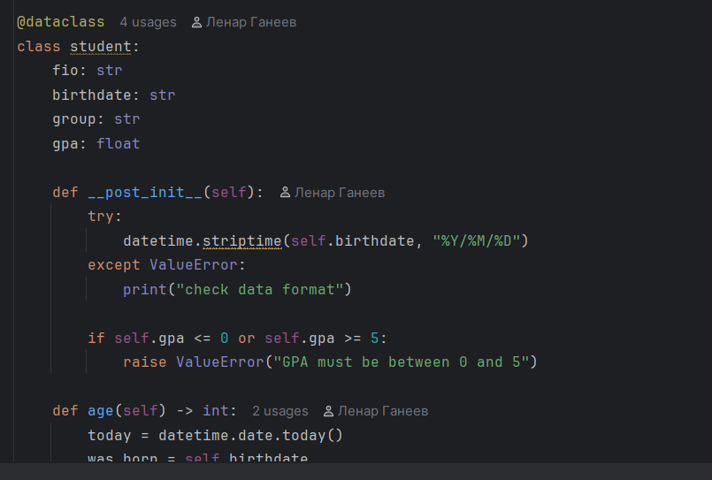
```python
from dataclasses import dataclass
import datetime
import json

@dataclass
class student:
    fio: str
    birthdate: str
    group: str
    gpa: float

    def __post_init__(self):
        try:
            datetime.striptime(self.birthdate, "%Y/%M/%D")
        except ValueError:
            print("check data format")

        if self.gpa <= 0 or self.gpa >= 5:
            raise ValueError("GPA must be between 0 and 5")

    def age(self) -> int:
        today = datetime.date.today()
        was_born = self.birthdate
        return today - was_born

    def to_dict(self):
        return {
            "fio": self.fio,
            "age": self.age(),
            "group": self.group,
            "gpa": self.gpa,
        }

    @classmethod
    def from_dict(cls, data: dict):
        return cls(fio=data["fio"], birthdate=data["birthdate"], group=data["group"])

    def __str__(self):
        return f"{self.name} ({self.group} age {self.age()}) gpa: {self.gpa} )"
```
### Задание 2
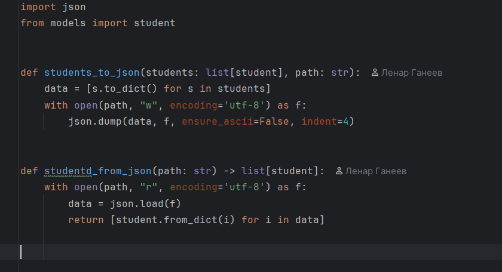
```python
import json
from models import student


def students_to_json(students: list[student], path: str):
    data = [s.to_dict() for s in students]
    with open(path, "w", encoding='utf-8') as f:
        json.dump(data, f, ensure_ascii=False, indent=4)


def studentd_from_json(path: str) -> list[student]:
    with open(path, "r", encoding='utf-8') as f:
        data = json.load(f)
        return [student.from_dict(i) for i in data]

```